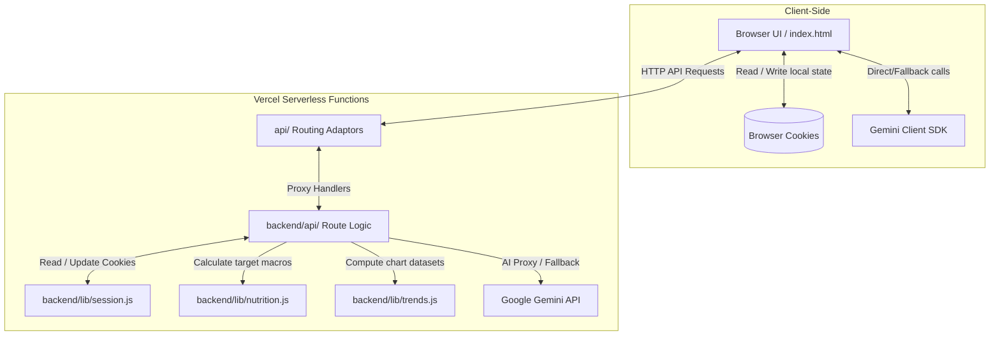

# 🥗 Nutrix

> **Your health, simplified.** A scientifically accurate, beautifully minimal nutrition tracker and AI assistant built with a static frontend and serverless backend architecture. No databases, no complex setups—just pure, instant insight.

---

## 🗺️ System Architecture

Nutrix uses a modern, lightweight serverless architecture that leverages **cookie-backed persistence** instead of databases. This guarantees fast responses, local-first responsiveness, and simple deployment.



---

## ✨ Features

- **📊 Personal Calorie & Macro Dashboard**: Track daily intake of Calories, Protein, Carbs, Fat, and Fiber. Uses interactive circular progress indicators (SVGs) and visual progress bars.
- **🎙️ Smart Meal Logging**: Log foods dynamically by text (e.g., `2 boiled eggs and a banana`) or attach a photo for instant image recognition and nutrition extraction.
- **🧬 Scientific Target Calculator**: Calculate daily targets based on personal details (Age, Gender, Height, Weight, Activity level, and Goal). Uses the **Mifflin-St Jeor equation** for BMR (Basal Metabolic Rate) and scales with TDEE. Supports cutting, bulking, and maintenance goals.
- **💬 Gemini AI Chatbot**: Talk to a personal AI nutrition assistant. Offers pre-configured suggestions (e.g., post-workout meals, breakfast ideas) and custom food photo attachments for analysis.
- **📈 Interactive Trends & Insights**: View daily, weekly, and monthly trends using beautifully structured **Chart.js** visuals showing actual calorie and macro splits against goal baselines.
- **🔄 Gemini Request Queue**: Implements an automatic client-side queue system. When high-demand limits or rate limits are met, requests are transparently retried with exponential backoff while presenting subtle progress states (e.g., yellow indicators).

---

## 📁 Repository Structure

```text
├── api/                  # Vercel entrypoint route adapters (thin proxies)
├── backend/              # Core backend implementation
│   ├── api/              # API controllers (Gemini proxy, Profile, Trends, Meals, Users)
│   └── lib/              # Shared helper functions
│       ├── errors.js     # Common error structure formatter
│       ├── nutrition.js  # Mifflin-St Jeor & TDEE calculation formulas
│       ├── session.js    # Cookie reading/writing helper
│       └── trends.js     # Data bucket generator for Chart.js
├── frontend/             # Single Page Application resources
│   ├── env.js            # Frontend configuration (model names & keys)
│   ├── index.html        # App structure & layout
│   ├── styles.css        # Vanilla CSS styling rules
│   └── script.js         # Client-side routing, Chart.js logic, and session queue
├── vercel.json           # Rewrites to map static assets & serverless endpoints
├── tsconfig.json         # TypeScript configuration (primarily linting/dev settings)
├── DEPLOY.md             # Detailed deployment checklist
└── working.md            # Internal architecture context & developer log
```

---

## 🛠️ Getting Started

### Prerequisites

- [Bun](https://bun.sh/) or [Node.js](https://nodejs.org/) installed.
- Vercel CLI (for running the serverless backend locally):
  ```bash
  npm i -g vercel
  ```

### Local Setup & Environment Configuration

1. **Clone the repository**:
   ```bash
   git clone <repo-url>
   cd Nutrix
   ```

2. **Configure Gemini Credentials**:
   - Get a Gemini API key at the [Google AI Studio](https://aistudio.google.com/apikey).
   
   - **For Local Static Testing**: Paste your API key in `frontend/env.js`:
     ```js
     const env = {
       API_KEY: "YOUR_GEMINI_API_KEY",
       MODEL: "gemini-2.5-flash-lite"
     };
     ```
     *Note: Ensure you do not commit your API key to public repositories.*

   - **For Deployed Backend Usage (Recommended)**:
     Leave the `API_KEY` blank in `frontend/env.js`, and Vercel will automatically route requests through the secure backend `/api/gemini` proxy using the Vercel-configured environment variable.

3. **Install dev dependencies**:
   ```bash
   bun install   # or npm install
   ```

---

## 🚀 Running Locally

To run the local server environment with the API endpoints functioning:

1. Link to your Vercel project (runs once):
   ```bash
   vercel link
   ```
2. Pull environmental parameters to local system:
   ```bash
   vercel env pull .env.local
   ```
3. Boot up the local serverless development server:
   ```bash
   bun run server  # calls: vercel dev
   ```
4. Open the displayed local development URL (usually `http://localhost:3000`).

---

## 🚢 Deploying to Vercel

The application is fully configured to deploy straight to Vercel.

1. **Add your Gemini API Key**:
   - Go to your Vercel Project Dashboard -> **Settings** -> **Environment Variables**.
   - Add a variable named `GEMINI_API_KEY` and input your key. Make sure to assign it to Production, Preview, and Development.

2. **Deploy to production**:
   ```bash
   vercel --prod
   ```

---

## 📊 Persistence Logic

To minimize hosting costs and complexity, Nutrix operates using standard **HTTP Cookies** for data persistence. 
- Meals log entries (`nutrix_meals`), profile configurations (`nutrix_profile`), and anonymous user identifiers (`nutrix_user_id`) are stored in base64url-encoded JSON payloads in the user's browser.
- The server decodes these payloads on-the-fly to calculate trends and profile values, returning them immediately.
- The frontend also caches this state locally to render changes instantly before the backend function resolves.
